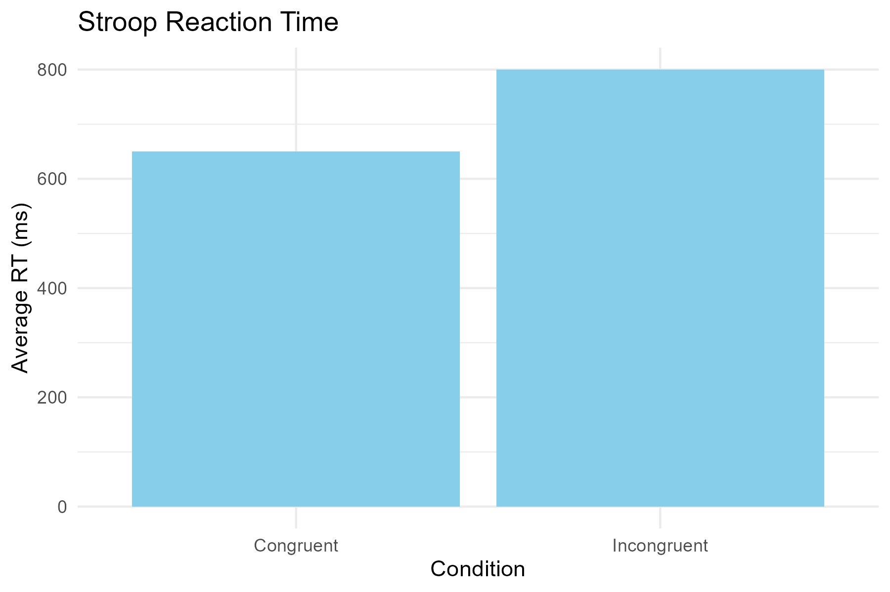

# פרויקט סטרופ
פרויקט זה עוסק בניתוח תוצאות ממבחן סטרופ, הבוחן את זמן התגובה של משתתפים למשימות הכוללות קונפליקט בין צבעים למילים.

## מבנה הפרויקט
- **collected_data/** - תיקייה זו כוללת נתונים שנאספו מהמשתתפים (לא מגובה בגיטהאב לפי קובץ `.gitignore`).
- **Assignement 7 - Raw Data.R** & **Assignment 7 - Filtered Data** - סקריפט לניתוח הנתונים במבחן סטרופ, כולל חישוב זמני תגובה והשוואה בין תנאים.
- **figures/** - תיקייה הכוללת גרפים המסכמים את תוצאות הניתוח.

## מטרות הפרויקט
- לבחון את ההבדלים בזמן התגובה בין משימות קונגרואנטיות (מילים וצבעים תואמים) לבין משימות אינקונגרואנטיות (מילים וצבעים שאינם תואמים).

## גרף תוצאות
להלן גרף המראה את זמני התגובה הממוצעים בתנאים קונגרואנטיים ואינקונגרואנטיים במבחן סטרופ:

